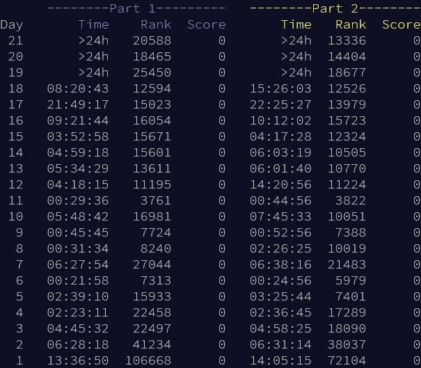

# Lessons learned
- Managing a Visual Studio Solution with multiple Projects
- Day 1
   - remembering `cctype` takes longer than rewriting anything within
   - regex negative lookbehind is still not supported in most languages (shoutouts to powershell 7)
   - awk is still relevant in 2023
- Day 2
   - `stringstream`s are convenient
- Day 3
   - autoformatting is still broken
   ```cpp
   for(std::array<int,2>d:std::array<std::array<int,2>,8>{
      {
         {
            -1,-1
         },{-1,0},{-1,1},{0,-1},{0,1},{1,-1},{1,0},{1,1}
      }}){
      void;
   }
   ```
   - `using enum` exists
- Day 5
   - start-end slices are much easier to reason with than start-range
- Day 7
   - `algorithm`s are convenient and make adding parallel execution easy
- Day 8
   - inputs are too nice
- Day 9
   - `from_chars` is much faster than `istream`s, but needs setup
   - `consteval from_chars` is not real, it cannot hurt you https://godbolt.org/z/73Yqs5cz9
- Day 12
   - `span<const T>` vs `basic_string_view<T>`
   - memoization in C++ is hard
- Day 13
   - writing code fast is easier than writing fast code
   - passing functions as template parameters
- Day 16
   - msvc does not do tail call optimization like gcc
- Day 17
   - i should learn A* and stop doing dijkstra every time
- Day 18
   - handparsing integers is faster than `from_chars`
   - msvc does not like emitting branchless conditional move

# Personal Times

